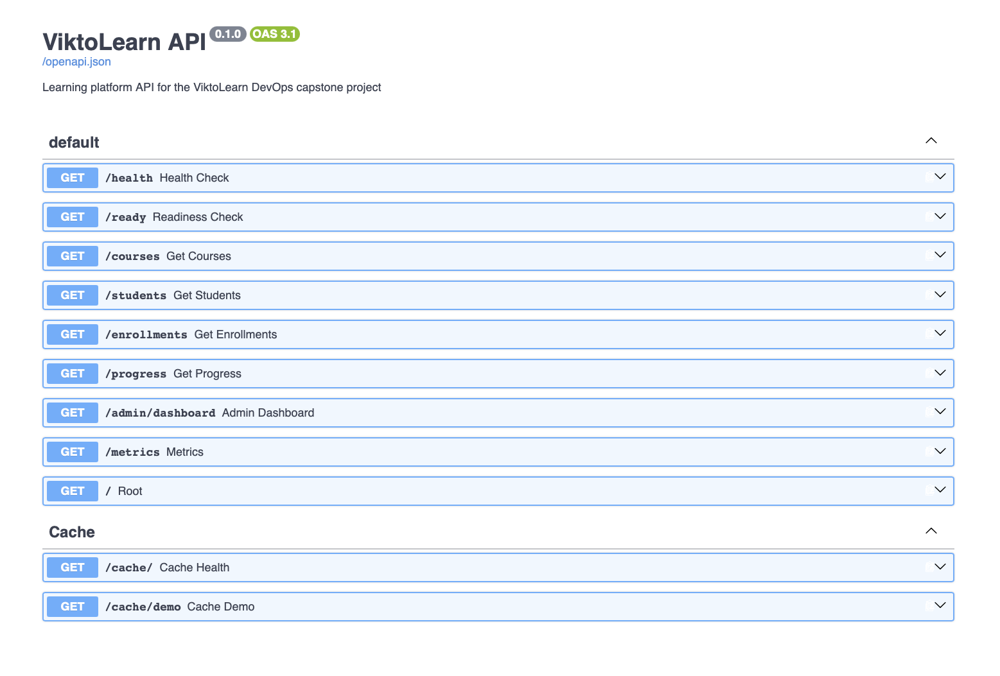
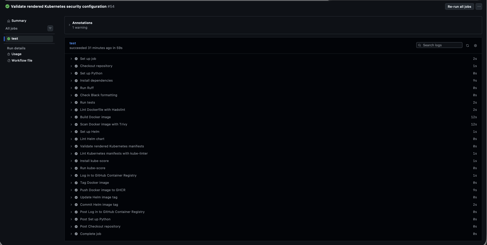
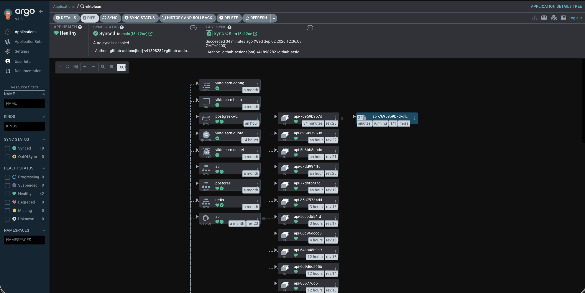
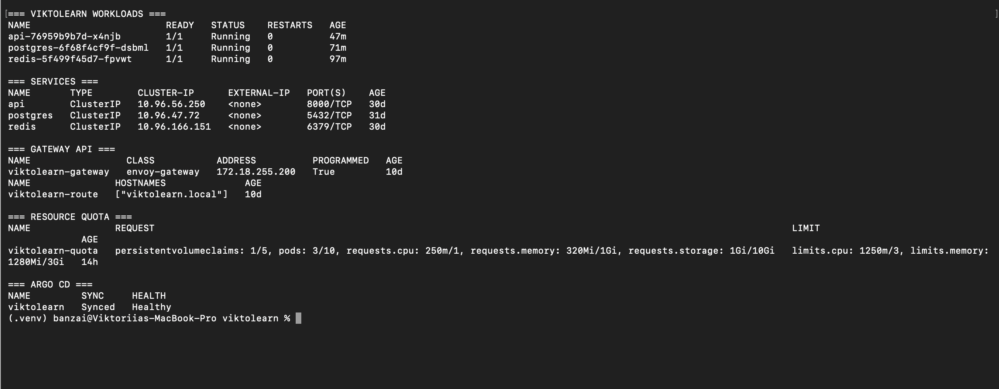
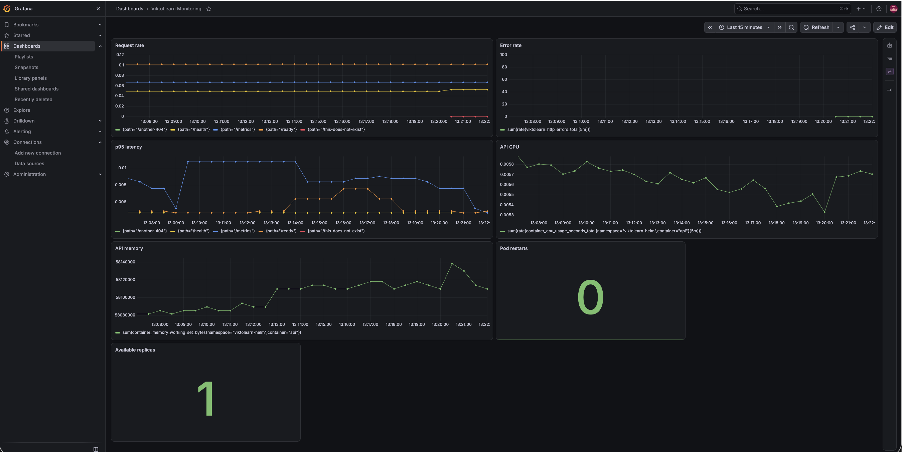
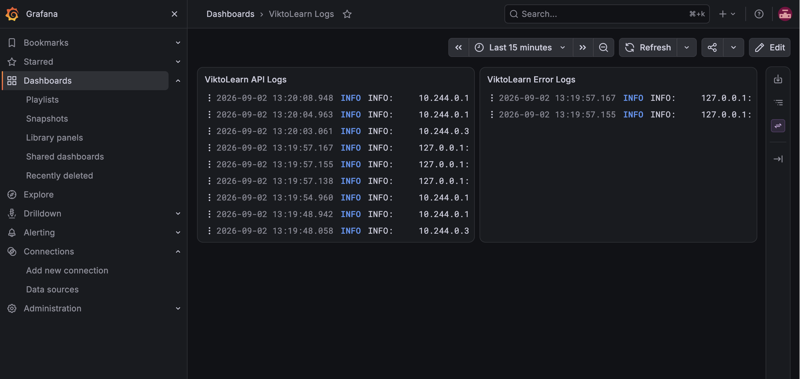

# ViktoLearn DevOps Platform

ViktoLearn is an end-to-end DevOps capstone project built around a FastAPI learning platform.

The project demonstrates the lifecycle of a containerized application: local development, automated testing, containerization, CI/CD, Kubernetes deployment, Helm packaging, GitOps delivery with Argo CD, security hardening, observability, centralized logging, alerting, and incident-response practices.

## Architecture

```text
Developer
    |
    v
GitHub Repository
    |
    v
GitHub Actions CI
    |
    +--> Ruff / Black / pytest
    +--> Hadolint
    +--> Docker build
    +--> Trivy
    +--> Helm lint
    +--> Rendered manifest validation
    +--> kube-linter
    +--> kube-score
    |
    v
GitHub Container Registry (GHCR)
    |
    v
Helm image tag update
    |
    v
Argo CD
    |
    v
Kubernetes (Kind)
    |
    +--> Envoy Gateway
    +--> FastAPI
    |      +--> PostgreSQL
    |      +--> Redis
    |
    +--> Prometheus / Grafana
    +--> Loki / Grafana Alloy

## Portfolio Highlights

ViktoLearn demonstrates an end-to-end DevOps delivery platform built around a FastAPI application with PostgreSQL and Redis.

The project covers:

- automated CI/CD with GitHub Actions
- container build and security scanning
- Kubernetes deployment with Helm
- GitOps reconciliation with Argo CD
- Gateway API routing with Envoy Gateway and MetalLB
- container and Kubernetes security hardening
- Prometheus metrics and alerting
- Grafana monitoring dashboards
- centralized logging with Grafana Alloy and Loki
- incident simulation, runbooks, and postmortems
- documented AWS and GCP deployment evolution

### Application API



### CI/CD Pipeline

The pipeline performs Python quality checks, automated tests, Dockerfile linting, container security scanning, Helm validation, Kubernetes validation, image publishing to GHCR, and GitOps image-tag updates.



[Detailed CI/CD documentation](docs/ci-cd.md)

### Kubernetes and GitOps

Argo CD continuously reconciles the Helm-defined desired state. Automated synchronization uses pruning and self-healing.



The local Kubernetes platform runs FastAPI, PostgreSQL, and Redis and exposes the application through Gateway API.



[Detailed Kubernetes documentation](docs/kubernetes.md)

### Monitoring

Prometheus collects application and Kubernetes metrics. Grafana provides dashboards for traffic, latency, CPU, memory, pod restarts, and replica availability.



### Centralized Logging

Grafana Alloy collects Kubernetes logs and forwards them to Loki. The logging dashboard separates application traffic from HTTP error logs.



[Monitoring and logging documentation](docs/monitoring-logging.md)

### Incident Response

Controlled incidents include PostgreSQL and Redis outages, CrashLoopBackOff, invalid images, missing configuration, broken endpoints, and elevated API latency.

- [Incident-response overview](docs/incident-response.md)
- [Operational runbook](docs/runbooks/incident-response.md)
- [Slow-API postmortem](docs/postmortems/slow-api.md)

### Project Documentation

- [Architecture and delivery flow](docs/architecture/architecture.md)
- [Setup guide](docs/setup/setup.md)
- [CI/CD pipeline](docs/ci-cd.md)
- [Kubernetes architecture](docs/kubernetes.md)
- [Monitoring and logging](docs/monitoring-logging.md)
- [Incident response](docs/incident-response.md)
- [AWS and GCP deployment model](docs/cloud-deployment.md)

---

## Local Development

Create and activate a virtual environment:

```bash
python3 -m venv .venv
source .venv/bin/activate
```

Install dependencies:

```bash
pip install -r requirements.txt
```

Start the API:

```bash
uvicorn app.main:app --reload
```

The application is available at:

- `http://127.0.0.1:8000`
- Swagger UI: `http://127.0.0.1:8000/docs`
- ReDoc: `http://127.0.0.1:8000/redoc`

Run tests:

```bash
pytest
```

## Docker Compose

The local containerized environment contains FastAPI, PostgreSQL, and Redis.

Start the stack:

```bash
docker compose up --build
```

Check containers:

```bash
docker compose ps
```

Stop the stack:

```bash
docker compose down
```

## CI/CD Pipeline

GitHub Actions validates application and infrastructure changes before publishing a new image.

The pipeline runs:

```text
Ruff / Black / pytest
        |
        v
Hadolint
        |
        v
Docker build + Trivy
        |
        v
Helm lint
        |
        v
Rendered manifest validation
        |
        v
kube-linter / kube-score
        |
        v
Publish image to GHCR
        |
        v
Update Helm image SHA
```

Container images are published to:

`ghcr.io/viktoriia-ds/viktolearn-devops-platform`

Deployments use immutable Git commit SHA image tags.

## GitOps with Argo CD

Argo CD manages the application using the Helm chart in `helm/viktolearn`.

The application follows the `main` branch and deploys into the `viktolearn-helm` namespace.

Automated synchronization uses pruning and self-healing.

The delivery flow is:

```text
Git push
   |
   v
GitHub Actions
   |
   v
Build + validation + security gates
   |
   v
GHCR image
   |
   v
Helm image SHA update
   |
   v
GitOps commit
   |
   v
Argo CD reconciliation
   |
   v
Kubernetes rollout
```

Git remains the source of truth for the deployed application.

## Kubernetes and Helm

The current GitOps deployment source is `helm/viktolearn`.

The Helm chart manages FastAPI, PostgreSQL, Redis, Services, persistent storage, configuration, ResourceQuota, NetworkPolicies, ServiceMonitor, PrometheusRule, and Gateway API resources.

The repository also contains manifests under `k8s/` representing Kubernetes configuration created during earlier stages of the project.

## Gateway API

Application traffic is modeled using Kubernetes Gateway API and Envoy Gateway:

```text
Client
   |
   v
MetalLB
   |
   v
Envoy Gateway
   |
   v
HTTPRoute
   |
   v
FastAPI Service
```

MetalLB provides LoadBalancer functionality for the local Kind environment.

## Security

ViktoLearn applies security controls across the container, CI/CD, and Kubernetes layers.

### Container Hardening

The application image uses a multi-stage Docker build and runs as a non-root user.

Kubernetes workloads use controls including:

- non-root execution
- `allowPrivilegeEscalation: false`
- read-only root filesystems
- dropped Linux capabilities
- `RuntimeDefault` seccomp profiles
- CPU, memory, and ephemeral-storage resource controls

PostgreSQL uses a narrowly scoped initialization container to prepare persistent-volume permissions while the database process itself runs as a non-root user.

### Security Validation

The CI pipeline includes:

- Hadolint for Dockerfile validation
- Trivy vulnerability scanning
- kube-linter
- kube-score
- custom validation of rendered Kubernetes manifests

The custom validator checks security-sensitive configuration after Helm rendering, including valid seccomp profile types.

### Network Security

NetworkPolicies define restricted communication between application components.

```text
Envoy Gateway ---> API
Monitoring -----> API
API ------------> PostgreSQL
API ------------> Redis
```

The main local Kind environment uses kindnet, which does not enforce NetworkPolicy. Enforcement was therefore tested separately in a disposable Kind cluster using Calico.

### Resource Controls

A Kubernetes ResourceQuota limits namespace-level CPU, memory, pod count, persistent-volume claims, and requested storage.

## Observability

### Metrics

The FastAPI application exposes Prometheus metrics through `/metrics`.

Application metrics include:

- HTTP request count
- HTTP request duration
- HTTP error count

A ServiceMonitor connects the API to the Prometheus Operator monitoring stack.

### Grafana

Grafana dashboards provide visibility into:

- request rate
- error rate
- p95 request latency
- API CPU usage
- API memory usage
- container restarts
- available replicas
- application logs

### Alerting

Prometheus alert rules cover:

- API unavailability
- high API error rate
- high p95 request latency

Alert lifecycle behavior was tested with controlled failure scenarios.

### Centralized Logging

Grafana Alloy collects Kubernetes application logs and sends them to Loki.

```text
FastAPI / Kubernetes logs
          |
          v
     Grafana Alloy
          |
          v
         Loki
          |
          v
Grafana Explore / Dashboards
```

## Incident Response

The project includes controlled incident simulations to practice detection, diagnosis, recovery, and documentation.

Scenarios exercised include:

- broken application endpoint
- PostgreSQL outage
- Redis outage
- CrashLoopBackOff
- invalid container image and failed rollout
- missing configuration
- slow API responses

Troubleshooting used Kubernetes pod state, events, logs, rollout information, Prometheus metrics, and Argo CD reconciliation behavior.

Operational documentation is stored in:

```text
docs/runbooks/
docs/postmortems/
```

The repository contains an incident-response runbook and a postmortem for the simulated slow-API incident.

## Repository Structure

```text
.
├── .github/
│   └── workflows/          # CI/CD pipeline
├── app/                    # FastAPI application
│   └── routes/             # API routes
├── argocd/                 # Argo CD Application
├── docs/
│   ├── postmortems/        # Incident postmortems
│   └── runbooks/           # Operational runbooks
├── helm/
│   └── viktolearn/         # GitOps Helm chart
├── k8s/                    # Kubernetes/base manifests
├── monitoring/             # Monitoring and logging configuration
├── scripts/                # Validation and utility scripts
├── tests/                  # Automated tests
├── Dockerfile
├── docker-compose.yml
├── requirements.txt
└── requirements-prod.txt
```

## Reliability and Recovery

Argo CD automated self-healing was tested by intentionally changing application state and observing reconciliation back to the desired Git state.

Kubernetes deployment failures were also simulated to practice diagnosis and recovery of unhealthy workloads.

## Local-First Design

ViktoLearn is a portfolio DevOps platform rather than a production SaaS deployment.

The infrastructure is intentionally local-first so the project can demonstrate Kubernetes and DevOps practices without requiring paid cloud infrastructure.

The architecture can be mapped to managed cloud services:

| Local Implementation | Cloud Equivalent |
| --- | --- |
| Kind | EKS / GKE / AKS |
| MetalLB | Cloud Load Balancer |
| PostgreSQL Deployment | Managed PostgreSQL |
| Kubernetes persistent storage | Cloud block storage |
| GHCR | Managed container registry |
| Argo CD | GitOps on managed Kubernetes |
| Prometheus / Grafana | Managed or self-hosted observability |

## Project Status

The implementation, containerization, CI/CD, Kubernetes, Helm, GitOps, observability, security, and incident-response phases are complete.

The technical implementation and portfolio documentation are complete. Remaining portfolio work focuses on the project demo video, CV presentation, and interview preparation.
