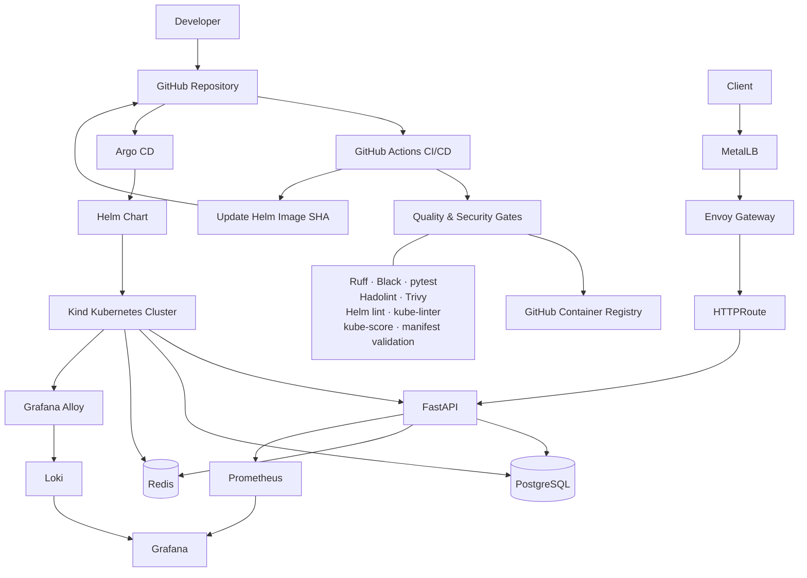

# ViktoLearn Architecture

## Delivery Flow

1. A change is pushed to GitHub.
2. GitHub Actions runs application, container, security, Helm, and Kubernetes validation.
3. The validated container image is published to GHCR using an immutable Git SHA tag.
4. CI updates the Helm image tag in Git.
5. Argo CD detects the GitOps change.
6. Argo CD reconciles the Helm release into the Kubernetes cluster.
7. Envoy Gateway routes application traffic to FastAPI.
8. FastAPI communicates with PostgreSQL and Redis.
9. Prometheus collects application and Kubernetes metrics.
10. Grafana visualizes metrics and Loki logs.
11. Grafana Alloy collects Kubernetes logs and forwards them to Loki.

## Local Kubernetes Networking

MetalLB provides a LoadBalancer address for Envoy Gateway inside the local Kind/Docker network.

The main Kind cluster uses kindnet. NetworkPolicy resources are deployed there, but kindnet does not enforce them. NetworkPolicy enforcement was validated separately using a disposable Kind cluster with Calico.
